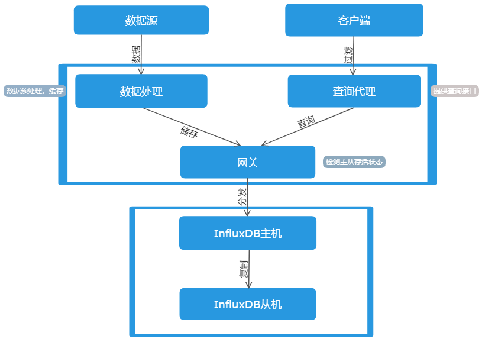

# tsdb
> InfluxDB数据库Java客户端

## 介绍

### 代理网关influxdb-proxy

使用influxdb-java客户端连接InfluxDB数据库。

### 数据处理data-handling

连接kafka服务器从其中获取数据，处理数据之后调用代理网关influxdb-proxy将数据插入数据库。

### 查询代理query

预处理查询语句，过滤危险查询代码，调用查询InfluxDB数据库。

### 公用模块common

变量、常量、异常、接口和工具类。

### 注册中心ra

代理网关influxdb-proxy中的接口由其他模块公用，使用SpringCloud微服务方式提供接口，可以将项目拓展为集群式高可用的服务。

## 项目编译运行

### 项目技术栈

Maven + (Spring Boot 1.5.12 + kafka + Jedis + Redis + Influxdb-java)

### 构建

本项目使用Maven来进行构建。

### 启动

Java客户端启动：

* 首先启动ra-0.0.1-SNAPSHOT.jar

* 再启动influxdb-proxy-0.0.1-SNAPSHOT.jar

* 最后启动data-handling-0.0.1-SNAPSHOT.jar和query-0.0.1-SNAPSHOT.jar

## 测试

### 测试报告

详见 [TSDB测试报告.docx](refer/TSDB测试报告.docx)

### 待优化问题

* 项目中链接InfluxDB使用服务influxdb-proxy，query和data-handling采用SpringCloud-feign微服务客户端来链接influxdb-proxy服务，feign在链接时请求数据长度有限制，因此在插入kafka中获取的数据时应控制插入数据大小。

* 由于InfluxDB数据库采用的是http_api接口，数据库服务器在链接量过大时会导致后续连接响应超时。因此使用kafka获取数据进行插入时，应控制插入数据的时间间隔（控制请求链接数量）。

## 参考文档

* [influxdb-java](https://github.com/influxdata/influxdb-java/blob/master/README.md)

* [Spring Boot整合Kafka的简单用例](https://blog.csdn.net/qq_36027670/article/details/79488880)

* [饿了么 Influxdb 实践之路](https://mp.weixin.qq.com/s?__biz=MzIwNjEwNTQ4Mw%3D%3D&mid=2651576941&idx=1&sn=69e6eddc2598908d48853676c04ce3c5&chksm=8cd9c489bbae4d9fa8ce0c6d0bb09e09788e6feec4a3e756e06c9c2d445713cb08dff0b90f9b)
